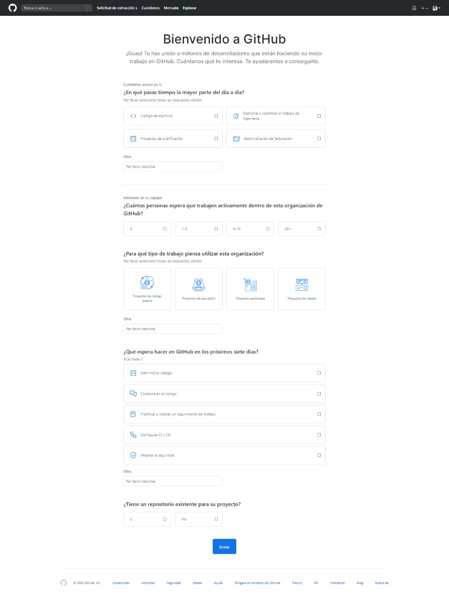

# EDgit
**Documentación de flujo de trabajo remoto con GIT**

## Organización

Se recomienda crear una organización que sea la propietaria del repositorio principal. A partir de dicho repositorio los miembros o colaboradores podrán hacer un *fork* hacia sus cuentas personales.

### Pasos para crear una organización en GitHub y trabajar en remoto

1. Click en tu foto perfil (Esquina superior derecha).

2. Click en Settings.

3. Click en Organizaciones (Menú izquierdo).

4. Click en Nueva organización.

5. Elegir el plan que mejor se adapte a nuestro proyecto.

6. Darle nombre a nuestra organización y registrar email.

7. Agregar los miembros de nuestra organización por nombre de usuario de GitHub o email.

8. Llenar un cuestionario de GitHub.

9. Una vez completados los pasos empezar a trabajar en nuestra nueva organización

---

## Creación de Fork

Para crear un *fork* debes iniciar sesión con tu cuenta de GitHub, una vez dentro debes dirigirte a la Landing Page del proyecto del que quieras sacar tu **Fork**.

>En esta ocasión será desde edteamlat/Edgit

---

## Como trabajar con 2 o más remotos

Listar remotos:
`git remote -v`

Agregar remotos:
`git remote add EDgit git@github.com:edteamlat/EDgit.git`

Eliminar remotos:
`git remote remove EDgit`

---

#### Contribución

***Elaborado por: [Beto Quiroga](https://github.com/betoquiroga)*** 

***Modificado por: [Hugo D Lyo](https://github.com/HugoDLyo) Nuevo estudiante de Diseño Web*** :mortar_board: :computer:
